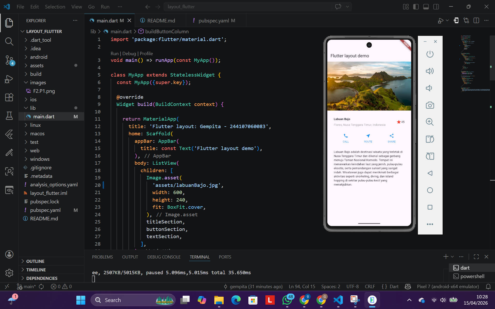
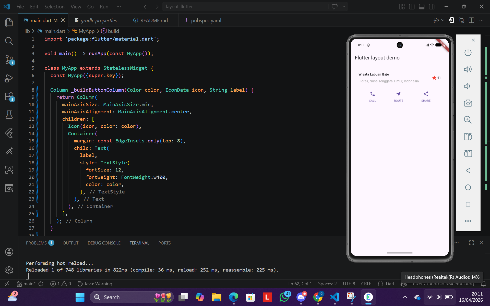
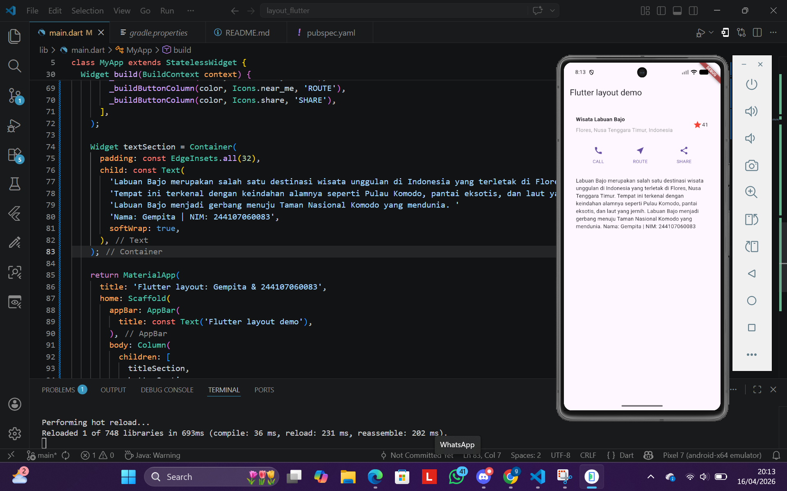
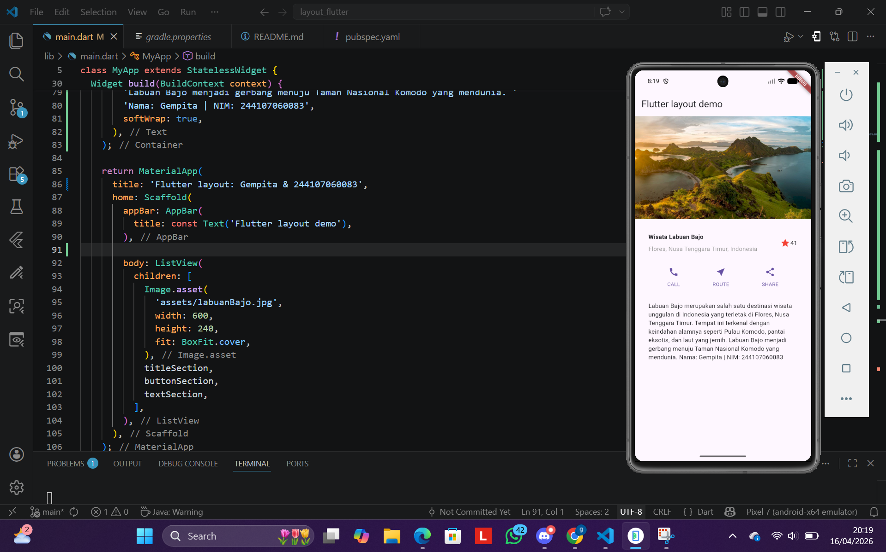

# Laporan Praktikum Flutter - Layout Flutter

**Nama**    : Gempita Fitri Nurdini  
**Kelas**   : SIB 2F  
**Absen**   : 12  
**NIM**     : 244107060083  

---

## Praktikum 1: Membangun Layout di Flutter

Pada tahap ini saya membuat layout sederhana menggunakan Flutter dengan widget Row, Column, Container, dan Expanded. Layout tersebut digunakan untuk menampilkan informasi wisata Labuan Bajo seperti gambar, judul, lokasi, rating, tombol aksi, dan deskripsi.

Pada tahap ini saya juga mempelajari cara mengatur posisi elemen menggunakan Row dan Column, serta memberikan jarak menggunakan padding agar tampilan lebih rapi.

---

## Praktikum 2: Implementasi button row

Pada tahap ini saya menambahkan bagian tombol yang terdiri dari CALL, ROUTE, dan SHARE.
Saya menggunakan method _buildButtonColumn() agar kode lebih ringkas dan tidak berulang.

Saya juga menggunakan MainAxisAlignment.spaceEvenly untuk mengatur jarak antar tombol agar rapi.

---

## Praktikum 3: Implementasi text section

Pada tahap ini saya menambahkan bagian deskripsi (text section) ke dalam layout. Teks berisi informasi mengenai wisata Labuan Bajo serta identitas diri (nama dan NIM).

Teks ditempatkan di dalam widget Container dengan padding agar memiliki jarak dari tepi layar. Properti softWrap: true digunakan agar teks dapat menyesuaikan lebar layar dan tidak keluar dari batas tampilan.

---

## Praktikum 4: Implementasi Image Section

Pada tahap ini saya menambahkan gambar menggunakan Image.asset.
Selain itu, saya mengubah layout menjadi ListView agar bisa di-scroll.

Properti BoxFit.cover digunakan agar gambar dapat menyesuaikan ukuran container dan tetap memenuhi area yang tersedia tanpa merusak proporsi.

